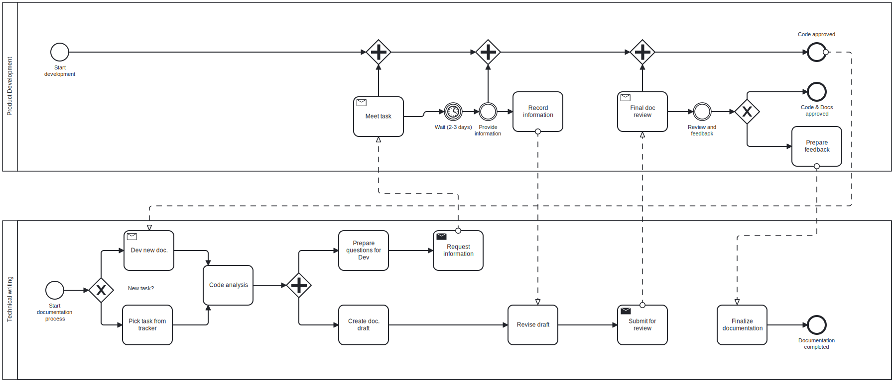

# Процесс разработки документации к коду

1. **Анализ существующей документации**
   - Узнать мнение разработчиков о текущей документации:
     - Что им нравится/не нравится?
     - Какая информация нужна, но отсутствует?
     - Какие форматы представления предпочтительнее?
   - На основе фидбэка разработать шаблоны документации.

2. **Создание новой документации**
   - Писать новую документацию, используя разработанные шаблоны.
   - Старую документацию править только по цепочке зависимостей от новой.

3. **Налаживание процессов**
   - В процессе сбора требований:
     - Устанавливать коммуникации с разработчиками.
     - Выявлять ключевые точки взаимодействия.
   - На этой основе строить процессы ревью.

Процесс разработке документации можно представить так:

## Как готовиться к взаимодействию с разработчиками по документации?

Разработчик не обязан объяснять всё "на пальцах"! К нему следует обращаться за ревью деталей и тонкостей реализации, а не за готовой информацией. Поэтому нужно:

- Приходить с готовыми материалами, либо с **конкретными** вопросами по компонентам.
- Самостоятельно разбираться после получения ответов.

### Схема взаимодействия с разработчиками по документации

1. **Провести самостоятельный анализ кода:**

   - Разобраться в логике, назначении и работе кода;
   - Определить, с какими компонентами он взаимодействует;
   - Выявить зависимости;
   - Подготовить **UML-диаграмму классов** для визуализации связей;
   - По возможности собрать код в бинарник (`CMake`, `gcc` и т.д.).

2. **Описать код так, как его понимаешь**.

3. **Провести тесты и проверить гипотезы**.

4. **Подготовить черновик документации**.

5. **Собрать документацию и проанализировать её целостность**.

## Какие вопросы задавать и как интервьюировать разрабочиков?

Задавать следует только те вопросы, на которые действительно не знаешь ответа. Например: «Почему здесь используется такая-то функция, если есть стандартная?»

Вопросы необходимо подкреплять ссылками на код и сразу же фиксировать ответы в виде inline-комментариев.

Главная фишка интервью — моментальная запись информации удобным способом. Лучше всего делать это прямо в IDE, в коде. Можно создать отдельную ветку в репозитории с названием, отражающим суть интервью, и фиксировать все пояснения там.

Встречи должны быть короткими (до 30–40 минут) и проходить по заранее подготовленной агенде, где следует указать проблемные места в коде, чтобы разработчик мог ознакомиться с контекстом до разговора.

Также важно заранее понимать, с какими компонентами взаимодействует код. Чем полнее будет картина, тем эффективнее пройдёт обсуждение — это позволит сократить количество встреч за счёт общего понимания архитектуры.

## Что после интервью?

После получения ответов на вопросы нужно "на горячую" всё поправить, перепроверить ещё раз, что ничего не упущено, и вернуться с финально доработанной документацией к разработчику. Также стоит приложить ссылку на предыдущую встречу или напомнить о том, что было на прошлой встрече. Главное — сохранить контекст разработки документации.